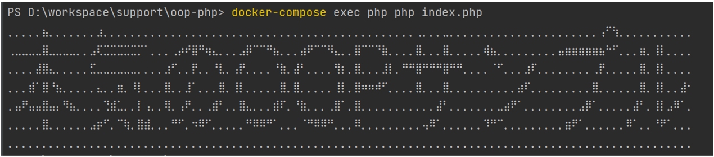

# PHP版 本気の OOP サンプル

本気のDockerサンプルに続き学習環境をサクッと整えつつ、オブジェクト指向の理解を深めるために本気のOOPサンプルを作成しました。

昨今のプログラミングではフレームワークに依存した開発が主流ですが、多くのフレームワークではオブジェクト指向の理解がコード品質に大きく影響します。
しかし、学習しはじめの方にとって、フレームワークを扱うにあたりオブジェクト指向についてどこまで理解すればよいかを知る手段は無く、オブジェクト指向に苦手意識を持ってしまっている方も多いように見受けられます。

このサンプルは筆者であるsaburoの主観ではありますが、最近のPHP界隈では最も利用されているLaravelというフレームワークを利用するにあたり、最低限知識として知っておくとよい事をまとめたものです。

学習はsrc配下にあるREADME.mdから始めてください。

[学習を始める](src/README.md)

## ご利用の際のお願い

ご利用の際にはTwitterのフォローをお願いします。  
[@tarotyjp (saburo)](https://twitter.com/tarotyjp)

また、ハッシュタグ `#本気のOOPサンプル` と [本気のサンプルシリーズ](https://github.com/tarotyjp/sample-series) のURLと一緒にツイートしていただけると嬉しいです。

ツイートサンプル（コピペOK）

```text
PHP版 本気のOOPサンプルでオブジェクト指向の学習を始めましたー
https://github.com/tarotyjp/sample-series

#本気のOOPサンプル
#駆け出しエンジニアとつながりたい 
#プログラミング初心者 
#プログラミング初学者と繋がりたい 
```

## 概要

このサンプルは「本気のサンプルシリーズ」の一つです。  
本気のサンプルシリーズの一覧は下記よりご確認ください。

- [本気のサンプルシリーズ](https://github.com/tarotyjp/sample-series)

フレームワークを利用しないPHP学習に最適化したDockerサンプルです。  
このサンプルでは下記が利用できるようになっています。

- Linux / PHPを利用した開発環境
- xdebugにも対応
    - 詳細は省略します

## 利用されるバージョン

このサンプルで利用しているバージョンは下記のとおりです。  
適宜 `Dockerfile` を修正して学習に併せたバージョンでご利用ください。

| 環境    | バージョン | 補足                                 |
|-------|-------|------------------------------------|
| PHP   | 8.1   | `./src/learning` 配下で実装してください       |

## 環境セットアップ

ダウンロードからコンテナの作成までの使い方について詳しく知りたい方は下記を参考に準備しましょう。  
その後こちらにもどり手順を確認してください。

[本気のサンプルシリーズの使い方](https://github.com/tarotyjp/sample-series/blob/main/manuals/download-docker.md)

リポジトリをクローンして下記を実行してください。

1. docker-compose build --no-cache
2. docker-compose up -d

## 環境を作り直したい時

環境を作り直したい時のために全てを削除するシェルを作ってあります。  
それぞれの環境に合わせて下記を実行し、前述の「環境セットアップ」を実行してください。

Windows

```
docker-down-all.bat
```

Mac

```
bash docker-down-all.sh
```

## 動作確認

### PHP学習用の動作確認

下記のようにターミナルで実行することで確認します。    
＊ `docker compose up -d` を実行していない場合は先に実行してください

```bash
docker-compose exec php php index.php
```

ターミナル上で下記のように表示されれば動作確認OKです。  


