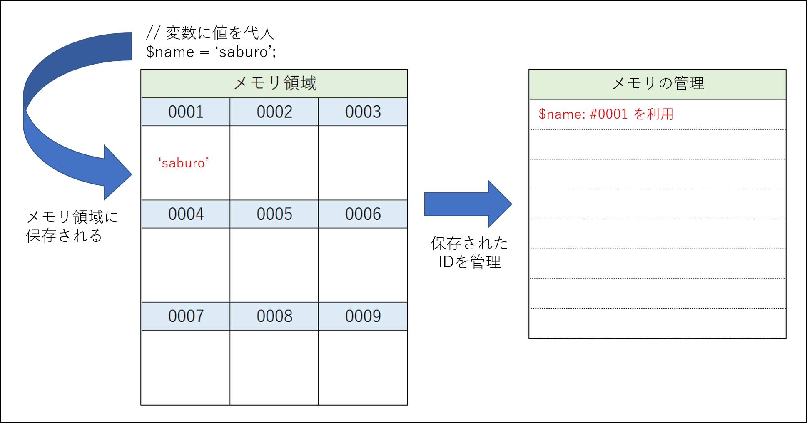
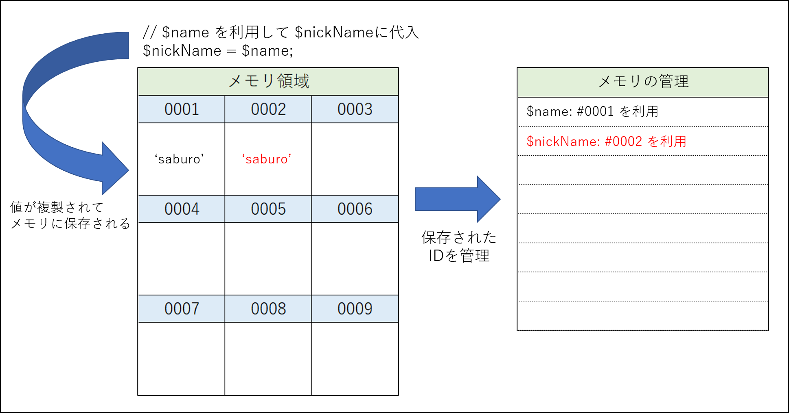
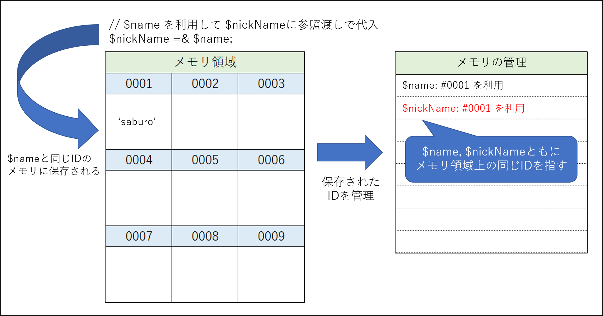

# 変数の値の更新

OOPと関連性が高く実装する際に気を付けなければならない注意点の一つに「値渡しと参照渡しの違い」というものがあります。

この章ではこの注意点がどのようなものなのかを体験します。

## 値渡しと参照渡しの違い

プログラミングで変数の正体は「メモリへの参照・更新」なのですが、変数には扱われ方が大きく分けて２種類あります。  
その２種類が「値渡し」と「参照渡し」です。

この２つの違いを順を追って説明ます。
まず、変数がメモリに格納される仕組みを簡単で良いので理解しましょう。

### 変数の仕組み

変数に値が保存されると、下記イラストのようにIDで管理されたメモリ領域に保存されます。

PHPにおいて下記のように `$name = 'saburo'` と代入された例で考えてみましょう。

```php
<?php
$name = 'saburo';
```

イラストで表現すると下記のようなイメージです。



### 値渡しの仕組み

値渡しでは変数から変数に代入した際に値が複製されて保存されます。

先ほどの例に加えて下記のように `$nickName = $name` と変数から変数に代入する例で考えてみましょう。

```php
<?php
$name = 'saburo';
$nickName = $name;
```

この実装では、 `$name` から値が複製されて `$nickName` に代入されます。  
イラストで表現すると下記のようなイメージです。



### 参照渡し仕組み

多くのプログラミングでは値私のほかに「参照渡し」という仕組みがあります。

PHPでは `$nickName` への代入を `= $name` だけではなく、 `=& $name` のように「アンパサンド」と一緒に代入することで参照渡しとなります。

```php
<?php
$name = 'saburo';
$nickName =& $name;
```

この実装では、 `$name` とおなじメモリ領域を利用して `$nickName` に代入されます。  
イラストで表現すると下記のようなイメージです。



### 値渡しと参照渡しの動作への影響

値渡しと参照渡しでは、変数の値を変更する時に大きく影響します。

どのような動作をするのか、実際にソースで確認してみましょう。  
まずは値渡しのサンプルソースを模写して実行し、動作を確認してください。

- サンプルソース: [src/sample/lesson8/lesson1.php](sample/lesson8/lesson1.php)
- 保存先： [src/learning/lesson8/lesson1.php](learning/lesson8/lesson1.php)

実行方法は下記のとおりです。  
＊ `docker compose up -d` を実行していない場合は先に実行してください

```bash
docker composer exec php php ./lesson8/lesson1.php
```

正しく模写されていれば下記のように出力され、`$nickName` への変更が `$name` に影響していないのが確認できます。

```text
------------
▼ 値渡しの動作確認

下記手順で実装
1. $name に `saburo` を代入
2. $nickName に $name を値渡しで代入
3. $nickName を 'さぶろう' に変更
　⇒ $name は変更しない
4. $name と $nickName の値を出力して確認
------------
$name: saburo
$nickName: さぶろう
```

続いて参照渡しのサンプルソースを模写して実行し、動作を確認してください。

- サンプルソース: [src/sample/lesson8/lesson2.php](sample/lesson8/lesson2.php)
- 保存先： [src/learning/lesson8/lesson2.php](learning/lesson8/lesson2.php)

実行方法は下記のとおりです。  
＊ `docker compose up -d` を実行していない場合は先に実行してください

```bash
docker composer exec php php ./lesson8/lesson2.php
```

正しく模写されていれば下記のように出力され、`$nickName` への変更が `$name` に **影響している** のが確認できます。

```text
------------
▼ 参照渡しの動作確認

下記手順で実装
1. $name に `saburo` を代入
2. $nickName に $name を参照渡しで代入
3. $nickName を 'さぶろう' に変更
　⇒ $name は変更しない
4. $name と $nickName の値を出力して確認
------------
$name: さぶろう
$nickName: さぶろう
```

これは、`$name`, `$nickName` ともに、メモリ上の同じIDを参照しているため、`$nickName` の変更が `$name` にも影響しているのです。

なお、関数やメソッド等では引数を定義する際に「参照渡しで受け取る」という指定ができます。  

下記は関数による参照渡しの定義例です。  
サンプルソースを模写して実行し、動作を確認してください。

- サンプルソース: [src/sample/lesson8/lesson3.php](sample/lesson8/lesson3.php)
- 保存先： [src/learning/lesson8/lesson3.php](learning/lesson8/lesson3.php)

実行方法は下記のとおりです。  
＊ `docker compose up -d` を実行していない場合は先に実行してください

```bash
docker composer exec php php ./lesson8/lesson3.php
```

正しく模写されていれば下記のように出力され、参照渡しで定義された関数内で更新された影響範囲が確認できます。

```text
------------
▼ 関数による参照渡し定義の動作確認

下記手順で実装
1. 関数を２種類定義
　⇒updateValue(): 引数を値渡しで定義
　⇒updateReferense(): 引数を参照渡しで定義
1. $name に `saburo` を代入
2. $nickName に $name を参照渡しで代入
3. $nickName を updateValue() を利用して 'さぶろう' に変更
4. $name と $nickName の値を出力して確認
5. $nickName を updateReferense() を利用して 'サブロウ' に変更
6. $name と $nickName の値を出力して確認
------------
>>>> updateValue()を利用して更新後値を出力
$name: saburo
$nickName: saburo

>>>> updateReferense()を利用して更新後値を出力
$name: サブロウ
$nickName: サブロウ
```

## OOPによるメモリ管理

この章ではここまでで値渡しと参照渡しについて学びましたが、OOPで実装する際には **明示的にクローンしない限りインスタンスは参照渡しで管理される** という事に注意してください。


OOPによる参照渡しの注意を体験するため、下記サンプルソースを模写して実行し動作を確認してください。

- サンプルソース: [src/sample/lesson8/lesson4.php](sample/lesson8/lesson4.php)
- 保存先： [src/learning/lesson8/lesson4.php](learning/lesson8/lesson4.php)

実行方法は下記のとおりです。  
＊ `docker compose up -d` を実行していない場合は先に実行してください

```bash
docker composer exec php php ./lesson8/lesson4.php
```

正しく模写されていれば下記のように出力され、`&(アンパサンド)` は利用していないにもかかわらず、参照渡しと同じ動作でAndroid / iPhoneの電話番号も代わってしまうことが分かります。

```text
------------
▼ OOPによる参照渡し

下記手順で実装
1. クラスを定義
　・SIM / iPhone / Android
2. 同一SIMインスタンスを利用して iPhone / Androidのインスタンスを生成
3. SIMの番号を変更する前に iPhone / Android の電話番号を出力して確認
4. SIMの電話番号を変更して iPhone / Android の電話番号を出力して確認
　⇒電話番号の変更には関数を利用
------------
>>>> SIMの番号を変更する前に iPhone / Android の電話番号を出力して確認
$Android: 090-0000-0000
$iPhone: 090-0000-0000

>>>> SIMの電話番号を変更して iPhone / Android の電話番号を出力して確認
$Android: 090-1111-1111
$iPhone: 090-1111-1111
```
