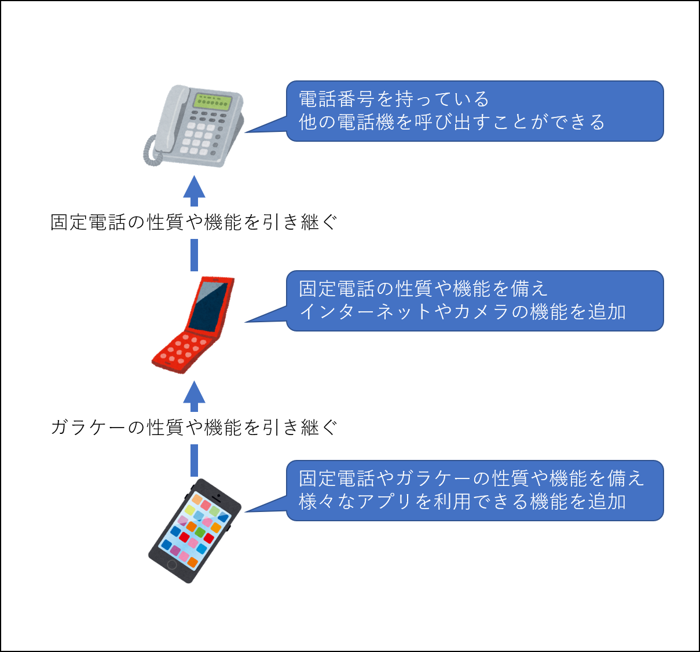
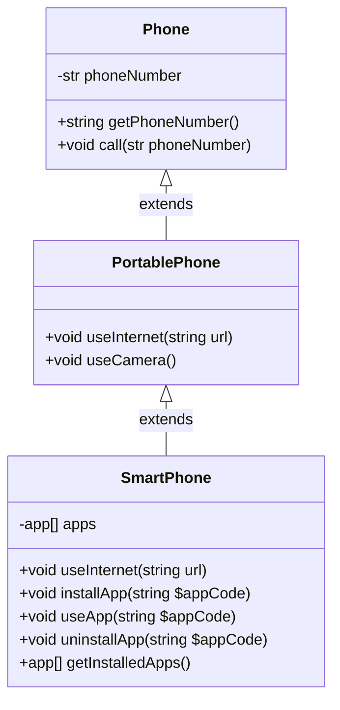
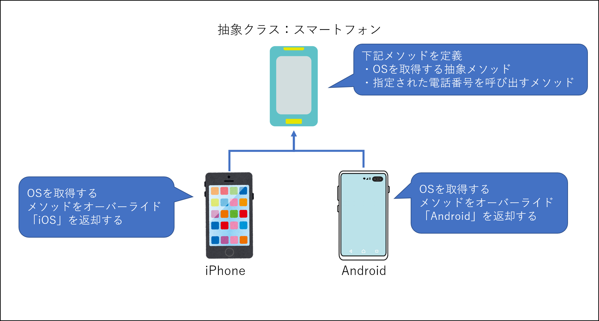
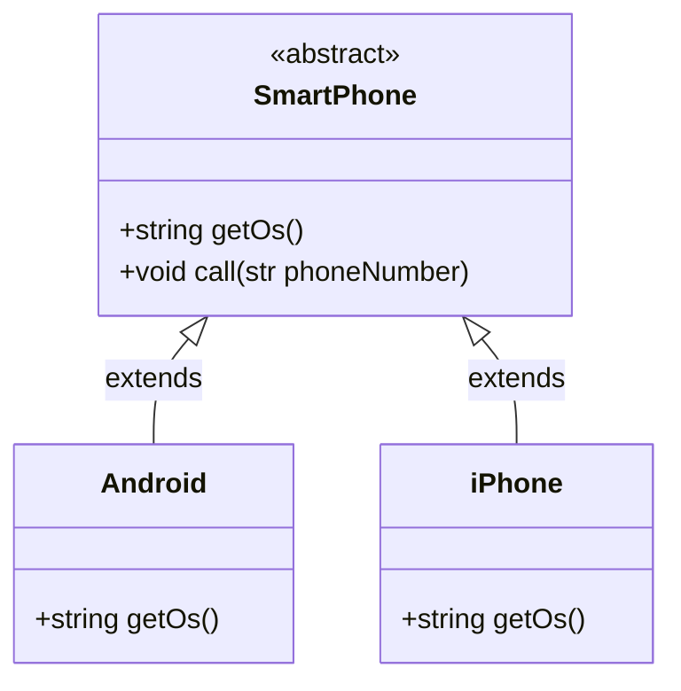
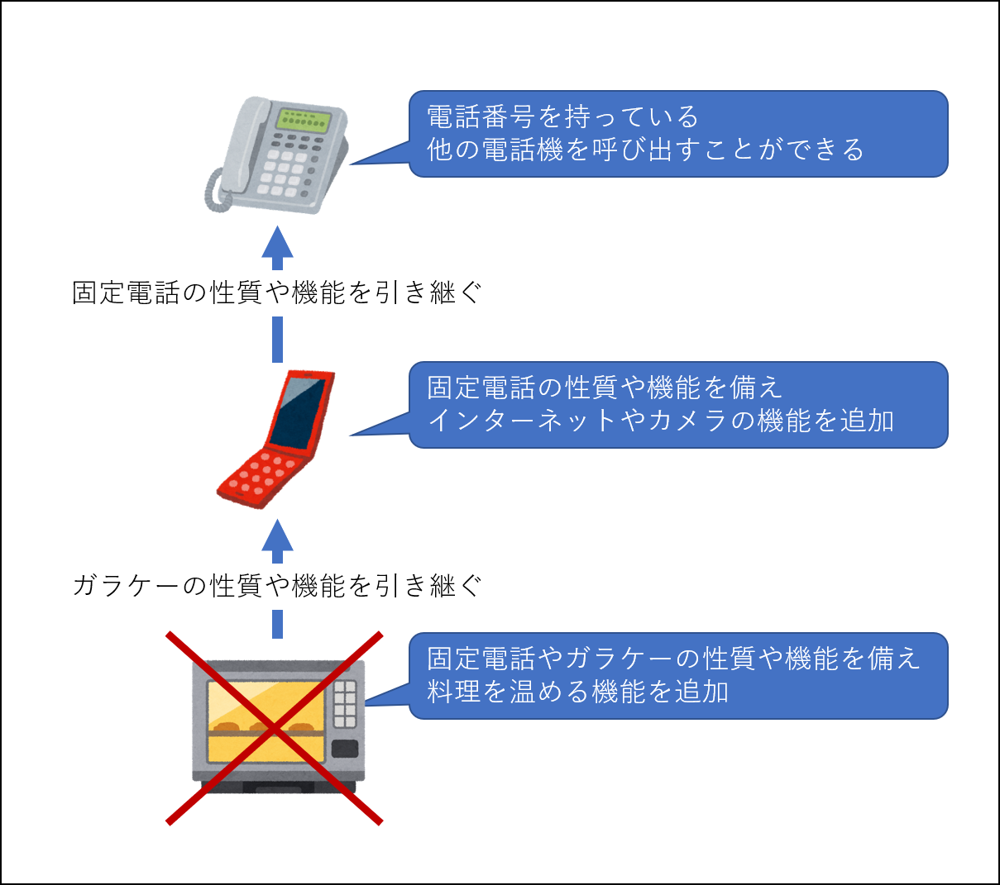

# 継承

既存のクラスの持つ振る舞いや性質を引継ぎつつ、拡張して実装する事を「継承」と呼びます。

これまで同様にスマートフォンを例にしてみましょう。

スマートフォンはその名の通り、主となる機能は「電話」です。  
スマートフォンに至るまでの電話の歴史を簡単に整理してみましょう。

|            | 説明                                                                                             |
|------------|------------------------------------------------------------------------------------------------|
| 家に設置する固定電話 | 個別に電話番号を持っています。<br>他の電話に対してコールする機能のみあります。                                                      |
| 携帯電話（ガラケー） | 固定電話の機能を引き継ぎます。<br>固定電話にない機能があります。<br>（インターネット・カメラなど）                                          |
| スマートフォン    | 固定電話と携帯電話の機能を引き継ぎます。<br>ガラケーで定義されているインターネットの利用を再定義しています。<br>固定電話と携帯電話にない機能があります。<br>（アプリの利用など） |

イラストで表現するとこんな感じです。



これらの継承関係をクラス図という図法で表現すると下記のようになります。  
今時点でクラス図の表記を覚える必要はありませんが、このような図法が存在することは知っておきましょう。



継承関係にあるクラスの事をOOPでは下記のように呼びます。

|          | 呼び方                     | 説明                        |
|----------|-------------------------|---------------------------|
| 継承されるクラス | 親クラス<br>（スーパークラスとも呼ばれる） | ガラケーから見た時の固定電話の事。         |
| 継承するクラス  | 子クラス<br>（サブクラスとも呼ばれる）   | 固定電話から見た時のガラケーやスマートフォンの事。 |

また、親クラスで定義されているプロパティやメソッドを子クラスで上書きすることをOOPでは「オーバーライド」と呼びます。

オーバーライド自体そのものはOOP共通の概念ですが、オーバーライドの仕組みは言語ごとに異なります。  
PHPにおけるオーバーライドの詳細はマニュアルをご参照ください。

[参考）PHP公式マニュアル：シグネチャの互換性に関するルール](https://www.php.net/manual/ja/language.oop5.basic.php#language.oop.lsp)

## PHPにおける継承の実装方法

継承とはどのように実装され、どのように利用されるものなのか、実際にソースで確認してみましょう。  
サンプルソースを模写して実行し、動作を確認してください。

- サンプルソース: [src/sample/lesson3](sample/lesson3)
- 保存先： [src/learning/lesson3](learning/lesson3)

実行方法は下記のとおりです。  
＊ `docker compose up -d` を実行していない場合は先に実行してください

```bash
docker composer exec php php ./lesson3/lesson.php
```

正しく模写されていれば下記のように出力されます。

```text
--------------
固定電話を利用します。

Lesson3\Classes\Phoneからcallメソッドを実行しています。
090-1111-1111を呼び出します。

--------------
携帯電話（ガラケー）を利用します。

▼ 親クラス（固定電話）で実装された機能の利用
Lesson3\Classes\PortablePhoneからcallメソッドを実行しています。
090-1111-1111を呼び出します。

▼ 携帯電話（ガラケー）で実装された機能の利用
Lesson3\Classes\PortablePhoneからuseCameraメソッドを実行しています。
写真を撮って保存しました
Lesson3\Classes\PortablePhoneからuseInternetメソッドを実行しています。
https://google.com/にアクセスします

--------------
スマートフォンを利用します。

▼ 親クラス（固定電話）で実装された機能の利用
Lesson3\Classes\PortablePhoneからcallメソッドを実行しています。
090-1111-1111を呼び出します。

▼ 親クラス（ガラケー）で実装された機能の利用
Lesson3\Classes\SmartPhoneからuseCameraメソッドを実行しています。
写真を撮って保存しました
Lesson3\Classes\SmartPhoneからuseInternetメソッドを実行しています。
Lesson3\Classes\PortablePhoneのuseInternetメソッドを拡張して再定義しています。
https://google.com/にアクセスします

▼ スマートフォンで実装された機能の利用
APP_CODE_HOGEをインストールします
〇：スマホアプリ：APP_CODE_HOGEを利用します

×：APP_CODE_FUGAはインストールされていません。
APP_CODE_FUGAをインストールします
〇：スマホアプリ：APP_CODE_FUGAを利用します

１回目：インストール済みのアプリケーションは下記のとおりです
  スマホアプリ：APP_CODE_HOGE
  スマホアプリ：APP_CODE_FUGA

APP_CODE_FUGAをアンインストールします
２回目：インストール済みのアプリケーションは下記のとおりです
  スマホアプリ：APP_CODE_HOGE
```

## 抽象化

OOPの重要な思考に「抽象化」というものがあります。  
抽象化とは同系統のオブジェクトから共通項を定義する事です。

これだけだとよくわからないですね。

抽象化を理解するための例として、下記を想像してみてください。

- スマートフォン
    - Android
    - iPhone

本来「スマートフォン」という電話の実態は存在せず、AndroidOSを搭載した電話機とiOSを搭載した電話機の総称であり概念的な存在です。  
そのため、「スマートフォン」自体のインスタンスを作ることは適切ではなく、AndroidとiPhoneというクラスがSmartPhoneクラスを継承することでインスタンスを作成できるようにしてみます。

これらの抽象化を部分的にイラストで表現するとこんな感じです。



参考までに前述のクラス図という図法で表現してみますが、表現方法について今時点覚える必要はありません。



ここで重要なのは、抽象化されたクラス「SmartPhone」は直接インスタンスを作成することは出来ないという事です。

どのような動作をするのか、実際にソースで確認してみましょう。  
サンプルソースを模写して実行し、動作を確認してください。

- サンプルソース: [src/sample/lesson4](sample/lesson4)
- 保存先： [src/learning/lesson4](learning/lesson4)

実行方法は下記のとおりです。  
＊ `docker compose up -d` を実行していない場合は先に実行してください

```bash
docker composer exec php php ./lesson4/lesson.php
```

正しく模写されていれば下記のように出力されます。

```text
------------
Androidのインスタンスを作成して下記を実行します。
・OSを取得して出力
・他の電話番号を呼び出す

AndroidのOS：Android
Lesson4\Classes\Androidからcallメソッドを実行しています。
090-0000-1111を呼び出します。

--------------
iPhoneのインスタンスを作成して下記を実行します。
・OSを取得して出力
・他の電話番号を呼び出す

iPhoneのOS：iOS
Lesson4\Classes\iPhoneからcallメソッドを実行しています。
090-0000-1111を呼び出します。

--------------
SmartPhoneのインスタンスの作成を試行しますが、抽象クラスなのでエラーになります。

PHP Fatal error:  Uncaught Error: Cannot instantiate abstract class Lesson4\Classes\SmartPhone in /var/www/sample/lesson4/lesson.php:47
Stack trace:
#0 {main}
  thrown in /var/www/sample/lesson4/lesson.php on line 47

Fatal error: Uncaught Error: Cannot instantiate abstract class Lesson4\Classes\SmartPhone in /var/www/sample/lesson4/lesson.php on line 47

Error: Cannot instantiate abstract class Lesson4\Classes\SmartPhone in /var/www/sample/lesson4/lesson.php on line 47

Call Stack:
    0.0023     393272   1. {main}() /var/www/sample/lesson4/lesson.php:0
```

## Tips：適切な継承関係

継承は便利な仕組みではありますが、やみくもに継承させて良いものではありません。

この章の最初の方では、固定電話、ガラケー、スマートフォンを例に継承関係をイラストで表現してみました。  
これらは「電話機としての機能を主」として発展してきたものであるため継承関係が成り立ちます。

しかし、次のイラストはどうでしょうか？



固定電話やガラケーの機能を電子レンジが継承してしまっています。
たしかに現実世界において、電話機能を持つ電子レンジは便利と感じる方もいるかもしれません。

しかし、OOPの継承関係としては正くなく、電子レンジは固定電話の子クラスとして定義すべきではありません。

このように、OOPでは実装のための方法だけではなく、どのように設計するかがとても重要な要素となります。
この「どのように設計するか」を、プログラミング現場では「クラス設計」と読んだり「モデリング」と呼んだりします。

OOPは「オブジェクト毎の役割を明確にすること」がとても重要であることを覚えておきましょう。
