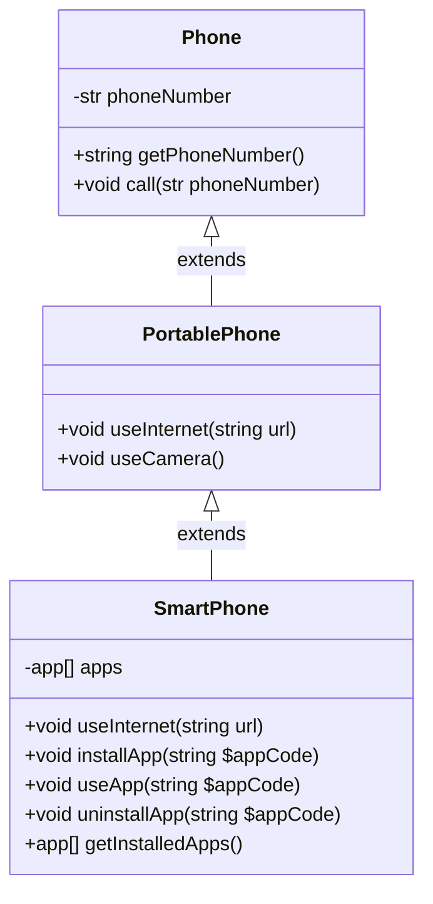
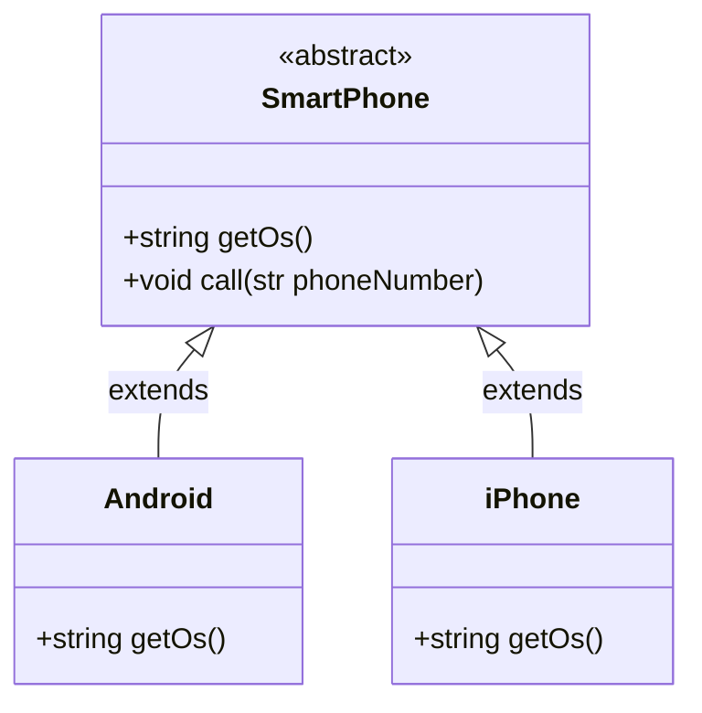

```mermaid
classDiagram
  class Phone {
    -str phoneNumber
    +string getPhoneNumber()
    +void call(str phoneNumber)
  }

  class PortablePhone {
    +void useInternet(string url)
    +void useCamera()
  }

  class SmartPhone {
    -app[] apps
    +void useInternet(string url)
    +void installApp(string $appCode)
    +void useApp(string $appCode)
    +void uninstallApp(string $appCode)
    +app[] getInstalledApps()
  }

  Phone <|-- PortablePhone : extends
  PortablePhone <|-- SmartPhone : extends
```

```mermaid
classDiagram
  class SmartPhone {
    <<abstract>>
    +string getOs()
    +void call(str phoneNumber)
  }

  class Android {
    +string getOs()
  }

  class iPhone {
    +string getOs()
  }

  SmartPhone <|-- Android : extends
  SmartPhone <|-- iPhone : extends
```
