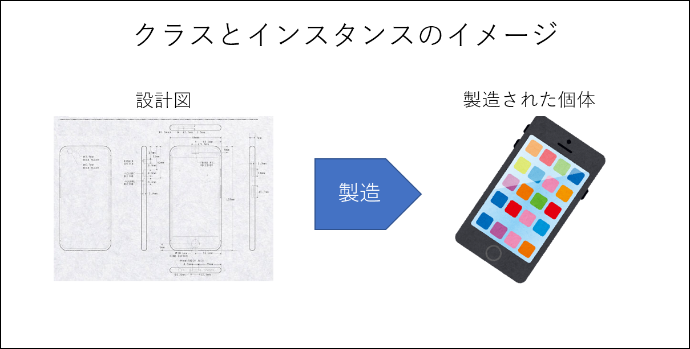
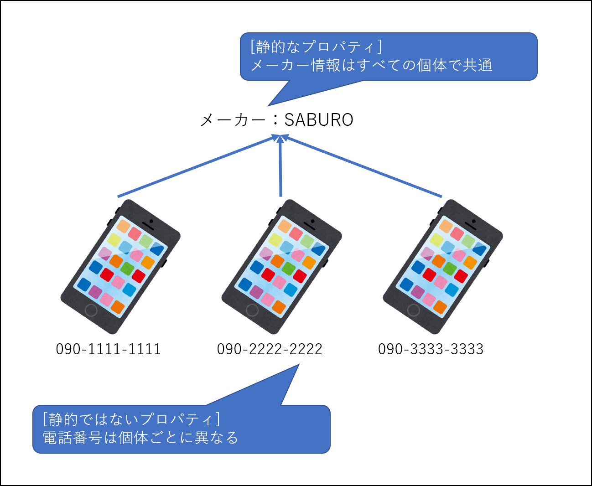

# OOPを構成する基本的な構成要素

この章では、OOPにおける基本的な構成要素である下記２点を学習します。

- クラス
- インスタンス

## クラスとインスタンス

クラスとは設計図のようなもので、主にメソッドやプロパティを定義します。

メソッドとは動作や振る舞いのことで、プロパティは性質・設定・状態ときには所有物なども指します。

インスタンスとは設計図を基に作成された個別の存在のことです。  
クラスから生成された全てのインスタンスは、クラスで定義された振る舞いを実行することができ、それぞれが個別に状態を持つことができます。

これだけだとわかりづらいですね。  
クラスをスマホに例えて説明してみましょう。

スマホを製造するためには、基となる設計図が必要ですよね。  
これがクラスに該当します。

この設計図から製造された個別の存在の事をインスタンスと呼びます。



設計図には「電話をかける」という振る舞い（メソッド）と「ボディカラー」という設定（プロパティ）が定義されているとします。  
この定義により設計図から製造された全てのスマホは共通して「電話をかける」という機能を有し「ボディーカラー」を変更することで自由に配色することができます。

## クラスとインスタンスの実装例

それでは、クラス・インスタンスをより深く理解するために、実際にソースで確認してみましょう。  
下記ソースを模写して実行してください。

- サンプルソース: [src/sample/lesson1](../sample/lesson1)
- 保存先： [src/learning/lesson1](../learning/lesson1)

実行方法は下記のとおりです。  
＊ `docker compose up -d` を実行していない場合は先に実行してください

```bash
docker composer exec php php ./lesson1/lesson.php
```

正しく模写されていれば下記のように出力されます。

```text
---------
スマートフォンがボディカラー[Blue]で生成されました

090-1234-5678を呼び出しています

このスマホのボディーカラーは[Blue]です
---------
スマートフォンがボディカラー[Red]で生成されました

090-1234-5678を呼び出しています

このスマホのボディーカラーは[Red]です
```

## 静的なプロパティ・メソッド

OOPのプロパティやメソッドには、インスタンスを作成しなくても利用可能な物があり、これらを公式の日本語PHPマニュアルでは「静的なプロパティ、静的なメソッド」と呼んでいます。
静的なプロパティ・メソッドでは、インスタンスで個別の存在で処理する必要のない情報や振る舞いを定義します。

同じ設計図から作られるスマートフォンにおいて、メーカーや機種名等は個別の存在毎に異なることはありませんね。  
このように、クラスが同じであれば異なるインスタンスでも同じ情報・同じ振る舞いをする定義のことを静的なプロパティ・静的なメソッドと呼びます。



静的なプロパティやメソッドには次のような特徴があります。

- インスタンスを生成せずにクラスから直接呼び出せる
- インスタンスから呼び出すことも出来る
- 静的なメソッドからは、静的ではないプロパティやメソッドを利用できない

静的なプロパティやメソッドがどのようなものなのか、実際にソースで確認してみましょう。  
サンプルソースを模写して実行し、動作を確認してください。

- サンプルソース: [src/sample/lesson2](../sample/lesson2)
- 保存先： [src/learning/lesson2](../learning/lesson2)

実行方法は下記のとおりです。  
＊ `docker compose up -d` を実行していない場合は先に実行してください

```bash
docker composer exec php php ./lesson2/lesson.php
```

正しく模写されていれば下記のように出力されます。

```text
--------------
クラスから静的メソッドを利用します。

メーカー：SABURO

--------------
インスタンスを作成してメソッドを利用します。
インスタンスから静的なメソッドを呼び出す方法は２種類ありますので、その点にも注意して模写しましょう。
スマートフォンがボディカラー[Blue]で生成されました

[静的でないメソッド] ボディーカラー：Blue
[静的なメソッド 呼び出し１] メーカー：SABURO
[静的なメソッド 呼び出し２] メーカー：SABURO

--------------
静的なメソッドから静的でないプロパティを利用しているメソッドを呼び出します。
この呼び出しはエラーになります。

PHP Fatal error:  Uncaught Error: Access to undeclared static property Lesson2\Classes\SmartPhone::$bodyColor in /var/www/sample/lesson2/Classes/SmartPhone.php:67
Stack trace:
#0 /var/www/sample/lesson2/lesson.php(44): Lesson2\Classes\SmartPhone::getStaticBodyColor()
#1 {main}
  thrown in /var/www/sample/lesson2/Classes/SmartPhone.php on line 67

Fatal error: Uncaught Error: Access to undeclared static property Lesson2\Classes\SmartPhone::$bodyColor in /var/www/sample/lesson2/Classes/SmartPhone.php on line 67

Error: Access to undeclared static property Lesson2\Classes\SmartPhone::$bodyColor in /var/www/sample/lesson2/Classes/SmartPhone.php on line 67

Call Stack:
    0.0027     393768   1. {main}() /var/www/sample/lesson2/lesson.php:0
    0.0125     398744   2. Lesson2\Classes\SmartPhone::getStaticBodyColor() /var/www/sample/lesson2/lesson.php:44
```

## Tips：OOPの専門用語について

OOPは様々なプログラミング言語で利用されている共通の概念ですが、言語によって専門用語に若干の違いがあります。  
Googleで検索する際にも、執筆者の言語経験を背景によっては公式のPHPマニュアルと異なる呼び方で記事を書いている方もいるのでご注意ください。

例として公式の日本語PHPマニュアルとその他の言語の違いをいくつか例をあげてみます。

| PHP                  | その他の言語例                |
|----------------------|------------------------|
| プロパティ                | フィールド                  |
| 静的なプロパティ・静的なメソッド     | クラスフィールド・クラスメソッド       |
| 静的でないプロパティ・静的でないメソッド | インスタンスフィールド・インスタンスメソッド |

また、「静的」の対義語は「動的」ですが、PHPにおいて「動的なプロパティ」は「静的でないプロパティ」を意味せず「可変プロパティ」を意味するので注意しましょう。

可変プロパティは昨今のモダンなプロジェクトでは利用しませんが、参考として公式の日本語PHPマニュアルのリンクを紹介しておきます。  
（PHP8.2以降では可変プロパティは廃止される可能性があるようです）

[参考）PHP公式マニュアル：可変変数](https://www.php.net/manual/ja/language.variables.variable.php)
