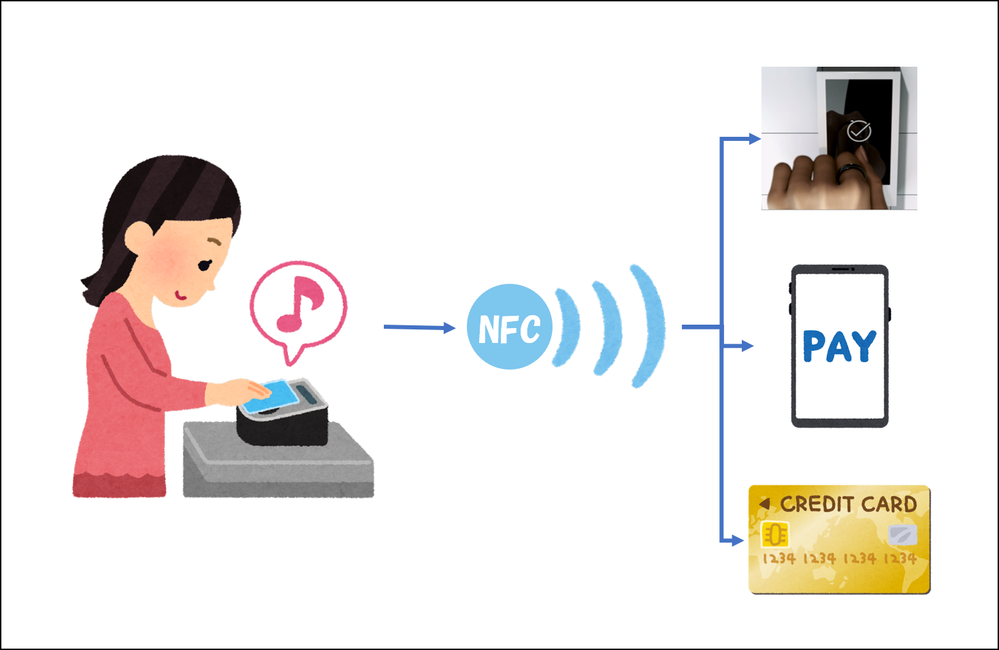
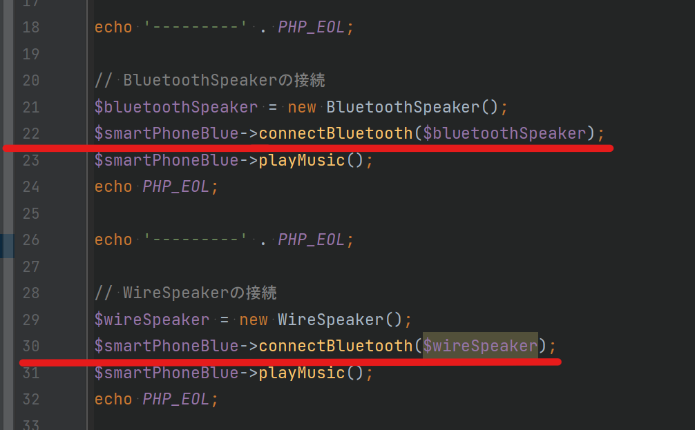

# ポリモフィズム（多相性 / 多態性）

共通のルールで定義された複数オブジェクトの同名のメソッドにおいて、異なる動作を定義する仕組みのことを「ポリモフィズム（多相性 / 多態性）」と呼びます。  
うーん、いまいちわかりづらいですね。

実は、ポリモフィズムはOOPの中でもエンジニアごとによる理解のブレが一番大きい概念なんです。  
そのため、この資料ではポリモフィズムを理解してもらうのではなく、ポリモフィズムに必要な知識であるインターフェースに焦点を当てます。

そうはいっても、せっかくなので軽くだけ触れておきます。

これまではスマートフォンを使って表現してきましたが、ポリモフィズムでは「タッチ決済」を例にあげてみます。

近年、セブンイレブン・ローソン・ファミマなど主要なコンビニではタッチ決済が導入され、その認知度も大分上がってきました。 タッチ決済は、Near field communication(以降、NFC)
という規格で実現しており、NFCに準拠さえすればその形状は問われません。  
（Near field communication は日本語では「近距離無線通信」と翻訳されます）

タッチ決済に対応している支払い方法は多岐にわたり、最近ではリング型の決済方法も出てきて話題になっています。

タッチ決済をイラストにするとこんな感じですね。  
NFCで定められているルールに従う事で、形状問わず決済できることを表現してみました。



このイラストで伝えたいのは下記の通りで、これこそがポリモフィズムです。

- オブジェクトが異なっても規格に従えば疎通ができる
- 疎通後の処理は実装するオブジェクトに依存する

このポリモフィズムを理解するためには「規格」をどのようにプログラムするかを理解する必要があり、OOPではインターフェースを利用します。

## インターフェース

前述の通り、インターフェースを端的に表現すると「規格」です。  
プログラミングの世界では、「何かしらの約束事を保証する」という具合に利用します。

先ほどのNFCを例に簡単なプログラム例をあげてみます。

```php
<?php
/**
 * NFCの規格を定義するインターフェース
 */
interface NFC {
    // NFCリーダーに近づけた時に呼び出される
    public function connect():string;
}

/**
 * NFCの規格にしたがって設計されたスマートリング
 */
class SmartRing implements NFC {
    public function connect():string {
        return '[NFCで利用されるIDを返却]';
    }
}

/**
 * NFCの規格にしたがって設計されたスマートフォン
 */
class SmartPhone implements NFC {
    public function connect():string {
        return '[NFCで利用されるIDを返却]';
    }
}

/**
 * NFCの規格にしたがって設計されたクレジットカード
 */
class CreditCard implements NFC {
    public function connect():string {
        return '[NFCで利用されるIDを返却]';
    }
}

/**
 * NFCの規格に従ったクラスを読み込むNFCリーダー
 */
class NFCReader {
    public function touch(NFC $nfc):void {
        $ncfId = $nfc->connect();
        // $ncfId を利用した処理
    }
}
```

上記プログラムを解説します。

| クラス / インターフェース                               | 説明                                                                                                               |
|----------------------------------------------|------------------------------------------------------------------------------------------------------------------|
| インターフェース<br>NFC                              | `NFC` を利用するためには、`connect()` を実装する必要がある事を定義しています。                                                                 |
| クラス<br>SmartRing<br>SmartPhone<br>CreditCard | `NFC` を `implements` し、`NFC` の定義にしたがって`connect()` を実装します。<br> `implements`したインターフェースに定義されているメソッドを実装しないとエラーが発生します |
| クラス<br>NFCReader                             | `touch()` メソッドでは `NFC` を `implements` したクラスのみを受け入れます。<br>このように定義することで、`connect()` メソッドが定義されていることが保証されます。         |

「何かしらの約束事を保証する」については実際のコードともに体験してみましょう。

### インターフェースの実装例

それでは、インターフェースをより深く理解するために、実際にソースで確認してみましょう。

実装例では、スマートフォンとBluetoothによる接続をプログラミングで表現しています。

下記ソースを模写して実行してください。

- サンプルソース: [src/sample/lesson7](../sample/lesson7)
- 保存先： [src/learning/lesson7](../learning/lesson7)

実行方法は下記のとおりです。  
＊ `docker compose up -d` を実行していない場合は先に実行してください

```bash
docker composer exec php php ./lesson7/lesson.php
```

正しく模写されていれば、下記のように出力されます。

```text
---------
スマートフォンがボディカラー[Blue]で生成されました
BuiltinSpeaker(内蔵スピーカー）から音を出します

---------
BluetoothSpeaker（ブルートゥーススピーカー）を接続します
BluetoothSpeaker（ブルートゥーススピーカー）が接続されました
BluetoothSpeaker（ブルートゥーススピーカー）から音を出します

BluetoothSpeaker（ブルートゥーススピーカー）を切断します
BluetoothSpeaker（ブルートゥーススピーカー）が切断されました
内蔵スピーカーに切り替えます

BuiltinSpeaker(内蔵スピーカー）から音を出します

---------
PHP Fatal error:  Uncaught TypeError: Lesson7\Classes\SmartPhone::connectBluetooth(): Argument #1 ($device) must be of type Lesson7\Interfaces\Bluetooth, Lesson7\Classes\WireSpeaker given, called in /var/www/sample/lesson7/l
esson.php on line 41 and defined in /var/www/sample/lesson7/Classes/SmartPhone.php:70
Stack trace:
#0 /var/www/sample/lesson7/lesson.php(41): Lesson7\Classes\SmartPhone->connectBluetooth(Object(Lesson7\Classes\WireSpeaker))
#1 {main}
  thrown in /var/www/sample/lesson7/Classes/SmartPhone.php on line 70

Fatal error: Uncaught TypeError: Lesson7\Classes\SmartPhone::connectBluetooth(): Argument #1 ($device) must be of type Lesson7\Interfaces\Bluetooth, Lesson7\Classes\WireSpeaker given, called in /var/www/sample/lesson7/lesson
.php on line 41 and defined in /var/www/sample/lesson7/Classes/SmartPhone.php on line 70

TypeError: Lesson7\Classes\SmartPhone::connectBluetooth(): Argument #1 ($device) must be of type Lesson7\Interfaces\Bluetooth, Lesson7\Classes\WireSpeaker given, called in /var/www/sample/lesson7/lesson.php on line 41 in /va
r/www/sample/lesson7/Classes/SmartPhone.php on line 70

Call Stack:
    0.0038     398808   1. {main}() /var/www/sample/lesson7/lesson.php:0
    0.0644     418224   2. Lesson7\Classes\SmartPhone->connectBluetooth($device = class Lesson7\Classes\WireSpeaker { private string $name = 'WireSpeaker（有線スピーカー）' }) /var/www/sample/lesson7/lesson.php:41
```

エラーが出力されていますね。

これは、 `WireSpeaker` クラスを `Bluetooth` で接続しようとしたために、エラーが発生しているのです。 少しエラーを詳しく見てみましょう。

```text
PHP Fatal error:  Uncaught TypeError: Lesson2\Classes\SmartPhone::connectBluetooth(): Argument #1 ($device) must be of type Lesson2\Interfaces\Bluetooth, Lesson2\Classes\WireSpeaker given, called in /var/www/learning/lesson2/lesson.php on line 30 and defined in /var/www/learning/lesson2/Classes/SmartPhone.php:60
```

長くてよくわかりませんね。  
改行を入れて少しわかりやすくしてみましょう。  
改行の頭には番号も付けてみました。

```text
1. PHP Fatal error:  
2. Uncaught TypeError: 
3. Lesson2\Classes\SmartPhone::connectBluetooth(): 
4. Argument #1 ($device) must be of type Lesson2\Interfaces\Bluetooth, Lesson2\Classes\WireSpeaker given, 
5. called in /var/www/learning/lesson2/lesson.php on line 30 
6. and defined in /var/www/learning/lesson2/Classes/SmartPhone.php:60
```

エラーでは下記のような事を教えてくれています。

| エラー行番号 | 説明                                                                                  |
|--------|-------------------------------------------------------------------------------------|
| 1行目    | これはコンパイルエラーを指しています。<br>コンパイルエラーとはPHPの構文として不適切なエラーのことです。                             |
| 2行目    | タイプエラーと書いてあります。<br>型に関係したエラーであることが分かります。                                            |
| 3行目    | エラーの発生しているステートメントです。                                                                |
| 4行目    | １つ目の引数は `Bluetooth` である必要があるが、指定された `WireSpeaker` は `Bluetooth` に対応していないことを指摘しています。 |
| 5行目    | 呼び出しを実行しているファイルパスと行番号です。                                                            |
| 6行目    | 呼び出されたメソッドが定義されているファイルパスと行番号です。                                                     |

また、PHPのプログラミングに特化した開発エディタを利用している場合、実装中にも下記のようにエラーの可能性を教えてくれています。  
画像の22行目と30行目に注目してください。



キャプチャはPhpStormでの表示例ですが、30行目のメソッド呼び出しの引数がハイライトされているのが分かりますね。

このように、PHPに特化した開発エディタを利用している場合、引数の指定が不適切であることを教えてくれます。
